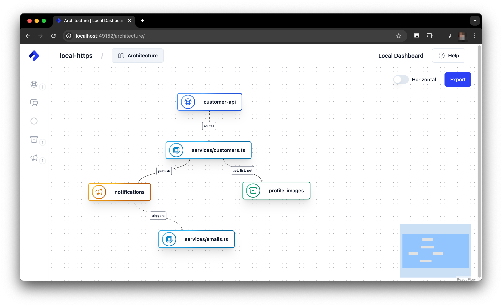

# sdk concepts

nitric:

> An open source universal backend framework, with concise infrastructure and pluggable deployment automation.

- survey: https://github.com/nitrictech/nitric/blob/v1.27.1/docs/docs/guides/nodejs/survey-application.mdx
- https://nitric.io/docs/guides/nodejs/survey-application

---

- https://github.com/nitrictech/nitric#-example-note-taking

```ts
import { api, bucket } from "@nitric/sdk";

const main = api("main");
const notes = bucket("notes").allow("read", "write");

main.post("/notes/:title", async (ctx) => {
  const { title } = ctx.req.params;
  await notes.file(title).write(ctx.req.text());
});
```

- 

```
my-project/
├── nitric.yaml
├── nitric.aws.yaml
└── services/
    ├── service1.ts
    └── service2.ts
```

```yaml
name: my-project
services:
  - match: services/*
    runtime: go
    type: ''
    start: go run ./$SERVICE_PATH/...
runtimes:
  go:
    dockerfile: ./golang.dockerfile
    context: ''
    args: {}
```

> Nitric provides functionality for provisioning and
> interacting with SQL databases.

```ts
import { sql, api } from '@nitric/sdk'

const db = sql('my-database')

api('example').get('/hello', async (ctx) => {
  const connStr = await db.connectionString()
  // TODO: Interact with the database using the connection string
  return ctx
})
```

```ts
import { sql } from '@nitric/sdk'

const db = sql('my-database', {
  migrations: 'file://migrations/my-database',
})
```

```ts
import { api } from '@nitric/sdk'
import { validate, logRequest } from '../middleware'

const customersApi = api('customers', {
  middleware: [logRequest, validate],
})
```

```ts
import { schedule } from '@nitric/sdk'

// Run every 5 minutes
schedule('process-transactions').every('5 minutes', async (ctx) => {
  console.log(`processing at ${new Date().toLocaleString()}`)
})

// Run at 22:00 Monday through Friday.
schedule('send-reminder').cron('0 22 * * 1-5', async (ctx) => {
  console.log(`reminder at ${new Date().toLocaleString()}`)
})
```

```ts
import { bucket } from '@nitric/sdk'

const profiles = bucket('profiles').allow('read')

const profilePicture = profiles.file('users/bruce-wayne/profile.png')
```

```ts
import { bucket } from '@nitric/sdk'

const profiles = bucket('profiles').allow('read')

const files = await profiles.files()

files.forEach((file) => {
  console.log(file.name)
})
```

```ts
import { bucket } from '@nitric/sdk'

const profiles = bucket('profiles').allow('write')

const profileImage = 'image data'

await profiles.file('users/bruce-wayne/profile.png').write(profileImage)
```

```ts
import { bucket } from '@nitric/sdk'

const profiles = bucket('profiles').allow('read', 'write')

// Get pre-signed URLs for downloading or uploading
const downloadUrl = await profiles.file('profile.png').getDownloadUrl({
  expiry: 3600, // Expiry defaults to 600 (10 minutes)
})

const uploadUrl = await profiles.file('profile.png').getUploadUrl({
  expiry: 3600, // Expiry defaults to 600 (10 minutes)
})
```

```ts
import { kv } from '@nitric/sdk'

const countries = kv('Countries').allow('set')

await countries.set('USA', {
  name: 'United States of America',
  population: 329500000,
})
```

```ts
import { kv } from '@nitric/sdk'

const countries = kv('Countries').allow('get')

const country = await country.get('USA')
```

```ts
import { kv } from '@nitric/sdk'

const countries = kv('Countries').allow('get')

for await (const key of countries.keys()) {
  console.log(key)
}
```

```ts
import { topic } from '@nitric/sdk'

const userCreatedTopic = topic('user-created').allow('publish')

await userCreatedTopic.publish({
  email: 'new.user@example.com',
})
```

```ts
import { topic } from '@nitric/sdk'
import { sendWelcomeEmail } from 'common'

const userCreatedTopic = topic('user-created')

userCreatedTopic.subscribe(async (ctx) => {
  // Extract data from the event payload for processing
  const { email } = ctx.req.json()

  sendWelcomeEmail(email)
})
```

```ts
import { queue } from '@nitric/sdk'

const transactionQueue = queue('transactions').allow('enqueue')

await transactionQueue.enqueue({
  message: 'hello world',
})
```

```ts
import { queue } from '@nitric/sdk'

const transactionQueue = queue('transactions').allow('enqueue')

await transactionQueue.enqueue([
  {
    message: 'batch task 1',
  },
  {
    message: 'batch task 2',
  },
])
```

```ts
import { queue } from '@nitric/sdk'

const transactionQueue = queue('transactions').allow('dequeue')

const tasks = await transactionQueue.dequeue(10)

for (let task of tasks) {
  // process your task's data
  console.log(task.message)

  // acknowledge when the task is complete
  await task.complete()
}
```

---

redwood sdk, react framework for cloudflare

- https://github.com/redwoodjs/sdk

```ts
import { defineApp } from "rwsdk/worker";
import { route, render } from "rwsdk/router";
import MyReactPage from "@app/pages/MyReactPage";

export default defineApp([
  render(Document, [
    route("/", () => new Response("Hello, World!")),
    route("/ping", function () {
      return <h1>Pong!</h1>;
    }),
    route("/react", MyReactPage)
    route("/docs", async () => {
      return new Response(null, {
        status: 301,
        headers: {
          "Location": "https://docs.rwsdk.com",
        },
      });
    }),
    route("/sitemap.xml", async () => {
      return new Response(sitemap, {
        status: 200,
        headers: {
          "Content-Type": "application/xml",
        },
      });
    }),
    route("/robots.txt", async () => {
      const robotsTxt = `User-agent: *
        Allow: /
        Disallow: /search
        Sitemap: https://rwsdk.com/sitemap.xml`;

      return new Response(robotsTxt, {
        status: 200,
        headers: {
          "Content-Type": "text/plain",
        },
      });
    }),
  ]),
]);
```

```ts
export default defineApp([
  render(Document, [
    index(Home), // JSX page
    route("/users", UsersPage), // JSX page
    route("ping", () => new Response(
      "pong", { status: 200 }
    )),
  ]),
]);
```

```ts
defineApp([
  sessionMiddleware,
  async function getUserMiddleware({ request, ctx }) {
    if (ctx.session.userId) {
      ctx.user = await db.user.find({ where: { id: ctx.session.userId } });
    }
  },
  route("/hello", [
    function ({ ctx }) {
      if (!ctx.user) {
        return new Response("Unauthorized", { status: 401 });
      }
    },
    function ({ ctx }) {
      return new Response(`Hello ${ctx.user.username}!`);
    },
  ]),
]);
```

---

> "In a typical application, your code defines its infrastructure needs implicitly—like when you access an S3 bucket or connect to a queue. Nitric makes requirements explicit declarations, ensuring the required cloud resources are provisioned, permissions are configured, and the app is connected to them in a consistent and reliable way."

nitric releases:
- https://github.com/nitrictech/nitric
- https://github.com/nitrictech/cli/releases/tag/v1.61.0

mermaid diagrams:
- https://nitric.io/docs/architecture
- https://github.com/nitrictech/nitric/blob/v1.27.1/docs/docs/architecture/index.mdx?plain=1
- https://github.com/nitrictech/nitric/blob/v1.27.1/docs/src/mdx/remark.mjs
- https://cdn.jsdelivr.net/npm/mermaid@11/dist/

---

> Medusa has a built-in durable execution engine to help complete tasks that span multiple systems. You orchestrate your operations across systems in Medusa instead of having to manage it yourself. Other commerce platforms don't have this capability, which makes them a bottleneck to building customizations and iterating quickly.

- https://medusajs.com/b2b/, Faster time to market with our framework
- https://docs.medusajs.com/learn/fundamentals/workflows#what-is-a-workflow
